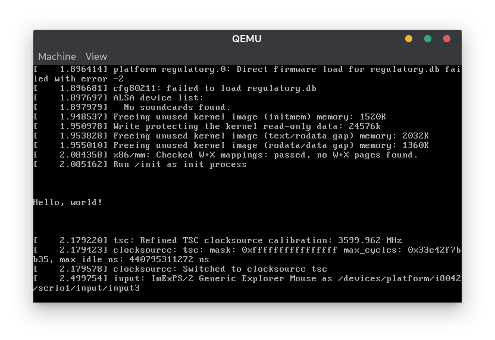

## Introduction

In a [previous article](/posts/the-linux-boot-process-explained) I explained the Linux boot process. The last step of the Linux boot process is the execution of init system's binary. But what if we don't want to have a conventional init system? In this article, we are going to write our own `/init` script.



## Compiling the Linux kernel

First, we need to compile the Linux kernel. To do this, we need to obtain the Linux source code. Let's clone the git repository.

```shell
git clone git://git.kernel.org/pub/scm/linux/kernel/git/torvalds/linux.git # clone the git repository
cd linux/
```

Next, let's choose a specific Linux version. You can see a list of versions using `git tag` command. I chose `v6.1`.

```
git checkout v6.1
```

Next, let's start the build process.


**Warning!** Linux compilation is a lengthy and very resource intensive process.


```
make mrproper
make defconfig # use the default config
make -j"$(nproc)" # compile with multiple jobs
```

`nproc` command returns the number of your CPU threads. To make the compilation faster, we use all the threads.

On my machine it took almost 5 minutes to finish.

It finished with a following message:

```
Kernel: arch/x86/boot/bzImage is ready
```

At this point we are pretty much ready to boot our kernel using QEMU, but the kernel is going to panic, because it can't find the `/init` executable in the initramfs. Let's create it!

## Creating the `/init` executable

All we need is a single statically linked ELF file. Here is an example C program:

```c
// init.c

#include <stdio.h>

int main()
{
    printf("\n\n\nHello, world!\n\n\n\n");

    while (1);
}
```

Notice the infinite `while` loop at the end of the `main` function. We can't exit the program, because the kernel will also panic as it does not expect the init process to quit.

We compile it using the following command:

```shell
gcc -static init.c -o init
```

The executable is ready to be put into the initramfs and executed by the kernel.

## Creating the initramfs

To create the initramfs, use the following commands:

```shell
mkdir initramfs/
cp init initramfs/
cd initramfs/
find . | cpio -oH newc | gzip > ../root.cpio.gz
ROOTFS_PATH="$(pwd)/../root.cpio.gz"
```

We define a `ROOTFS_PATH` variable, because we will use the path to the archive later.

Our initramfs is ready.

## Booting the system using QEMU

Now, we can boot our "system" using QEMU. Go back to the Linux kernel repository.

```shell
qemu-system-x86_64 -kernel arch/x86/boot/bzImage -initrd "$ROOTFS_PATH"
```

After running the command, we can see that `/init` has been executed successfully.



## Creating an ISO image

To create an ISO image that you can run in any other virtualization software or even a real hardware, run the following command:

```shell
make isoimage FDINITRD="$ROOTFS_PATH" FDARGS="initrd=root.cpio.gz"
```

After finishing, the generated ISO image is located in `arch/x86/boot/image.iso`.

## Installing BusyBox

We successfully booted a minimal Linux system with just a kernel and `/init` executable. It is not very useful though. Let's make it more interesting by installing BusyBox.

BusyBox is a software suite that provides several Unix utilities in a single executable file. It provides the utilities we commonly know and use, like: `ls`, `find`, `tree`, `touch`, `rm` and many more. BusyBox offers more than 480 commands.

First, we need to clone, configure and compile BusyBox.

```shell
git clone https://github.com/mirror/busybox.git
cd busybox/
make defconfig
echo CONFIG_STATIC=y >> .config
make -j"$(nproc)"
make CONFIG_PREFIX="$PWD/initramfs" install
```

This will generate many files inside `initramfs/` directory.

Next, we add the `/init` script inside the initramfs.

```shell
cd initramfs/
touch init
chmod +x init
```

Paste the following contents into the `/init` script.

```shell
#!/bin/sh

# mount required directories
mount -t proc proc /proc
mount -t sysfs none /sys
mount -t devtmpfs udev /dev

# launch interactive shell
/bin/sh

# if shell exits, poweroff to prevent kernel panic
poweroff -f
```

Finally, let's pack the initramfs.

```shell
find . | cpio -oH newc | gzip > ../root.cpio.gz
ROOTFS_PATH="$(pwd)/../root.cpio.gz"
```

Go back to the Linux kernel repository and again, create the ISO using the following command:

```shell
make isoimage FDINITRD="$ROOTFS_PATH" FDARGS="initrd=root.cpio.gz"
```

Now, the ISO image that was generated in `arch/x86/boot/image.iso` is basically the most minimal Linux distro. It contains only a Linux kernel and some basic utilities.

## Make a bootable USB

To run it on a real hardware, you need to make a bootable USB. Insert your empty USB drive and make sure to check its device path using something like `fdisk -l` or `lsblk`. My USB drive is `/dev/sdc`. To flash the USB drive with the ISO image, run the following command.

```shell
sudo dd if=arch/x86/boot/image.iso of=/dev/sdc
```

Now you can reboot your computer, go into your motherboard's boot menu and boot the system from the USB drive.

## Video


